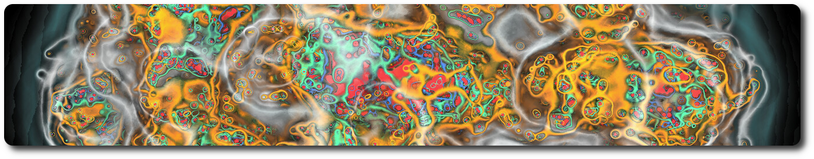

# Nuon Model Visualizer
Visualizer for the [Particles Composition and Interactions Using the Nuon Model](https://www.scirp.org/journal/paperinformation?paperid=124395) publication



## Introduction

This collaborative project emerged from an informal interaction with [Rene Brun](https://root.cern/about/project_founders/#Ren%C3%A9%20Brun), Senior physicist and CERN honorary member, following the publication of his groundbreaking work, [Particles Composition and Interactions Using the Nuon Model](https://www.scirp.org/journal/paperinformation?paperid=124395). Our collaboration ignited after I delivered a [presentation at CERN](https://indico.cern.ch/event/1253917/), delving into the realms of visualization and exploration within the EPFL Blue Brain Project. Specifically, I showcased the innovative capabilities of the [Blue Brain BioExplorer](https://github.com/BlueBrain/BioExplorer).

The Nuon Model Visualization, a pivotal aspect of our collaboration, capitalizes on BioExplorer custom graphical objects to compute magnetic fields derived from a set of 3D points and charges. This implementation, tailored for both CPU and GPU, heralds a paradigm shift in visualizing high-energy particle collisions, bringing us closer to a tangible representation of reality.

To bring this vision to life, the Nuon Model Visualizer seamlessly integrates with [ROOT](https://root.cern/) through its Python interface. By extracting collision data from ROOT, the visualizer accurately positions particles and dynamically renders magnetic interactions within the event.

One of the key enablers of our rapid progress was the modular architecture of BioExplorer. This framework facilitated efficient development, allowing us to achieve significant milestones in a matter of days.

While our journey is ongoing, I'm thrilled to unveil the first glimpses of this innovative approach to exploring the intricacies of high-energy physics. Stay tuned for further developments as we continue to push the boundaries of scientific visualization and exploration.


Follow the [rabbit hole](https://particle-physics.netlify.app/) if you want to see more!

## Deployment from source

In your favorite Python virtual environment, run:
```bash
pip install .
```

## Deployment using Docker

The Nuon Model Visualizer and the Blue Brain BioExplorer binaries are publicly available as docker images. The Blue Brain BioExplorer is designed to run in distributed mode, and is composed of 3 modules: A [server](https://hub.docker.com/r/bluebrain/bioexplorer), a [python SDK](https://hub.docker.com/r/bluebrain/bioexplorer-python-sdk), and a [web user interface](https://hub.docker.com/r/bluebrain/bioexplorer-ui). This means that there are 3 docker images to be downloaded on run. Those images can of course run on different machines.

**Note:** The Nuon Model Visualizer, as well as the Blue Brain BioExplorer are NOT a web application. They use web technologies for the user interface but run as a single session system that requires one back-end instance per user. There is no limitation in the number of user interface instances that can connect to the back-end, but they will all be sharing the same session.

In this example, we will expose the server on port 5000, the python SDK jupyter notebooks on port 5001, and the user interface on port 5002. One is free to change those ports at will.

### Server

```bash
docker run -ti --rm -p 5000:8200 bluebrain/bioexplorer
```

### Python SDK

```bash
docker run -ti --rm -p 5001:8888 favreau/nuon-model-visualizer
```

Note that a local folder can be specified to access personal notebooks:

```bash
docker run -ti --rm -p 5001:8888 -v <my_notebooks_folder>:/app/NuonModelVisualizer/notebooks favreau/nuon-model-visualizer
```

### Web User Interface

```bash
docker run -ti --rm -p 5002:8080 bluebrain/bioexplorer-ui
```

## Example

```python
from bioexplorer import BioExplorer
from nuon_model_visualizer import NuonModelVisualizer

# Connect to the BioExplorer server
be_url = 'localhost:5000'
be = BioExplorer(be_url)
core = be.core_api()

# Initialize Nuon Model Visualizer from ROOT file
nmv = NuonModelVisualizer(
    bio_explorer=be,
    root_proton_file='keep_findall_64004.root',
    root_collision_file='collide_298792_events.root')

# Set magnetic field parameters
nmv.set_field_parameters(
    cutoff_distance=50, sampling_rate=0.25,
    gradient_shading=False, gradient_offset=0.01, epsilon=1.5, 
)

# Select event ID
event_id = 0

# Render event for a given timestamp
nmv.render_event(
    event_id=event_id, voxel_size=0.1,
    magnetic=True, colormap='nuons.1dt', value_range=[-0.005, 0.1]
)
```

The example [notebook](./notebooks/events_collide.ipynb) demonstrates how to send the ROOT data to the BioExplorer.
